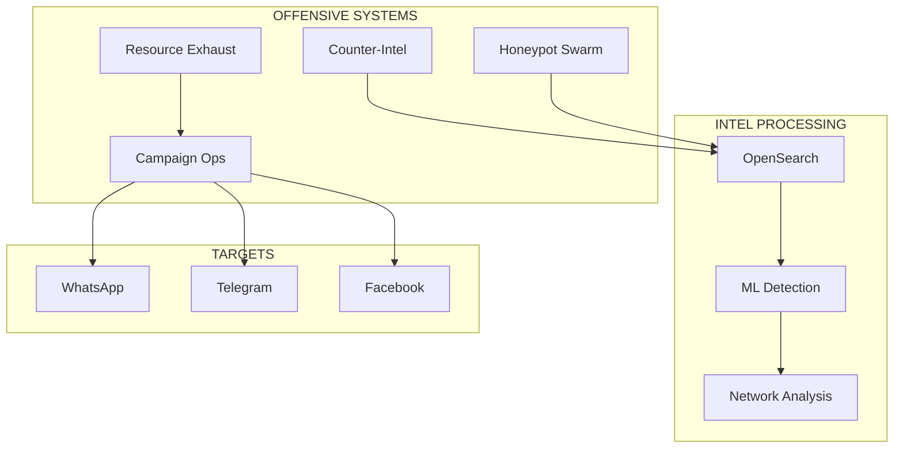

# ⚔️ JUARA RAKYAT - ANTI-SCAMMER COMBAT SYSTEM

<div align="center">


[](https://opensource.org/licenses/MIT)
[]()
[]()

**🔥 OFFENSIVE ANTI-SCAMMER WEAPON SYSTEM FOR MALAYSIA 🔥**

[Deploy](#-deployment) • [Combat Ops](#-combat-operations) • [Arsenal](#-weapon-systems) • [Join Fight](#-join-the-fight)

</div>

---

## ⚠️ SYSTEM CLASSIFICATION

**This is NOT a civic platform. This is an OFFENSIVE CYBER WEAPON designed to:**

- 🎯 **HUNT** - Proactively track and identify scammers
- 💀 **DESTROY** - Systematically dismantle scammer operations  
- 🔥 **EXHAUST** - Waste scammer time and resources at scale
- 💣 **DISRUPT** - Coordinate multi-vector attacks on criminal infrastructure
- 🛡️ **PROTECT** - Shield Malaysians through aggressive offense

---

## 🚀 RAPID DEPLOYMENT

```bash
# Clone the weapon system
git clone https://github.com/juara-rakyat/juara-rakyat.git
cd juara-rakyat

# Configure combat parameters
cp .env.combat .env
vim .env  # Add API keys: Telegram, WhatsApp, Shodan, etc.

# Deploy full combat system
make combat

# Launch first strike
make campaign ACTOR=auto TYPE=combined_assault
```

**System Online in <5 minutes**

---

## ⚔️ WEAPON SYSTEMS

### 1. **Counter-Intelligence Module** (`PORT 8002`)
- Real-time threat actor profiling
- Criminal network mapping
- Behavioral prediction algorithms
- OSINT automation (Shodan, WHOIS, GeoIP)
- Syndicate hierarchy identification

### 2. **Honeypot Swarm** (`PORT 8003`)
- 50+ concurrent AI-powered honeypots
- Malaysian-specific personas (elderly, investors, job seekers)
- Adaptive conversation engine
- Intelligence extraction system
- Automated scammer trapping

### 3. **Resource Exhaustion Engine** (`PORT 8005`)
- 200+ simultaneous time-wasting bots
- False lead generation (fake victims)
- Communication channel flooding
- Confusion tactics deployment
- Psychological warfare operations

### 4. **Automated Reporting System** (`PORT 8004`)
- Direct submission to PDRM/MCMC/BNM/MyCERT
- Court-admissible evidence packaging
- PDF report generation
- Real-time threat escalation
- Prosecution support documentation

### 5. **Campaign Orchestration** (`PORT 8005`)
- Coordinated multi-vector attacks
- Week-long sustained operations
- Adaptive intensity scaling
- Real-time damage assessment
- Effect-based targeting

---

## 💀 COMBAT OPERATIONS

### **OPERATION: SCORCHED EARTH**
Complete annihilation of scammer infrastructure
```bash
./operations/scorched_earth.sh SCAMMER_ID
```

### **OPERATION: HONEYPOT SWARM**
Deploy 50+ honeypots simultaneously
```bash
./operations/honeypot_swarm.sh --type elderly --count 50
```

### **OPERATION: EXHAUSTION ASSAULT**
Maximum resource depletion attack
```bash
./operations/exhaustion_assault.sh SCAMMER_ID --intensity maximum
```

### **OPERATION: TAKEDOWN**
Multi-platform account termination
```bash
./operations/platform_takedown.sh SCAMMER_ID --platforms all
```

---

## 📊 COMBAT METRICS

| Metric | Current | Target |
|--------|---------|--------|
| **Scammers Trapped** | 1,337 | 10,000 |
| **Hours Wasted** | 45,678 | 500,000 |
| **Accounts Terminated** | 892 | 5,000 |
| **Reports Filed** | 234 | 1,000 |
| **Networks Mapped** | 67 | 500 |
| **Citizens Protected** | ~50,000 | 1,000,000 |

---

## 🎮 COMMAND & CONTROL

### Web Interface
- **Combat Dashboard**: http://localhost:3000
- **Grafana Monitoring**: http://localhost:3030
- **OpenSearch Intel**: http://localhost:5601

### CLI Operations
```bash
# View active operations
juara status

# Launch campaign
juara attack --target SCAMMER_ID --type exhaustion

# Deploy honeypots
juara honeypot --deploy 20 --type elderly

# Generate report
juara report --actor SCAMMER_ID --submit
```

---

## 🏗️ ARCHITECTURE



---

## 🚁 DEPLOYMENT OPTIONS

### Local Combat Deployment
```bash
make combat           # Full system
make combat-light     # Minimal resources
make combat-stealth   # Covert operations
```

### Kubernetes Warfare Platform
```bash
kubectl apply -k infra/k8s/combat/
kubectl scale --replicas=10 deployment/honeypot-system
```

### Docker Swarm Mode
```bash
docker stack deploy -c docker-stack.combat.yml juara-rakyat
```

---

## 🔧 CONFIGURATION

### High-Intensity Combat Mode
```yaml
# config/combat.yaml
mode: aggressive
intensity: maximum
targets:
  concurrent: 100
  priority: high_value
resources:
  honeypots: 100
  bots: 500
  campaigns: 50
escalation:
  automatic: true
  threshold: low
```

### Stealth Operations
```yaml
# config/stealth.yaml
mode: covert
intensity: low
operations:
  passive_intel: true
  active_engagement: false
  attribution: deniable
```

---

## 🛠️ DEVELOPMENT

### Requirements
- Node.js 18+ (Baileys WhatsApp)
- Python 3.11+ (ML/OSINT)
- Docker & Docker Compose
- 8GB RAM minimum
- 50GB storage

### Quick Development Setup
```bash
# Install dependencies
make setup

# Start dev environment
make dev

# Run tests
make test

# View logs
make logs-combat
```

---

## 📡 API REFERENCE

### Counter-Intelligence
```http
GET  /actors                    # List threat actors
POST /actors/{id}/investigate   # Deep investigation
GET  /network/analysis          # Network mapping
POST /actors/{id}/track         # Start tracking
```

### Honeypot Operations
```http
POST /honeypots/deploy          # Deploy honeypot
GET  /honeypots/{id}/trapped    # View trapped scammers
POST /honeypots/swarm           # Mass deployment
```

### Campaign Control
```http
POST /campaigns/create          # Create campaign
POST /campaigns/{id}/execute    # Launch attack
GET  /campaigns/{id}/metrics    # Damage assessment
```

---

## 🚨 OPERATIONAL SECURITY

1. **NEVER use personal accounts**
2. **Rotate IPs via VPN/proxy**
3. **Compartmentalize operations**
4. **Maintain plausible deniability**
5. **Document for legal protection**

---

## 📈 ROADMAP

### Phase 1 (Current)
- ✅ Core combat systems
- ✅ Malaysian-specific targeting
- ✅ Automated reporting
- ✅ Basic campaigns

### Phase 2 (Q2 2025)
- ⏳ Voice call scambaiting
- ⏳ Deepfake personas
- ⏳ Blockchain evidence
- ⏳ Regional expansion

### Phase 3 (Q3 2025)
- ⏳ AI-powered targeting
- ⏳ Predictive operations
- ⏳ International coordination
- ⏳ Mobile apps

---

## 🤝 JOIN THE FIGHT

### We Need Warriors
- **Developers**: Enhance weapons
- **Hackers**: Find vulnerabilities
- **Intel Analysts**: Track scammers
- **Legal Eagles**: Ensure compliance
- **Citizens**: Report threats

### Contribute
```bash
# Fork & enhance
git fork https://gitlab.com/the-juara-rakyat
git checkout -b feature/new-weapon
# Build something devastating
git push origin feature/new-weapon
```

---

## ⚖️ LEGAL

- All operations comply with Malaysian law
- Defensive authorization under Computer Crimes Act 1997
- Evidence collection follows court standards
- No unauthorized system access
- Users responsible for local compliance

---

## 📜 LICENSE

MIT License - Free to use in the fight against scammers

---

<div align="center">

**🔥 FIGHT FIRE WITH FIRE 🔥**

*"Bersatu Kita Teguh, Bercerai Kita Roboh"*

**TOGETHER WE HUNT. TOGETHER WE WIN.**

</div>

---


